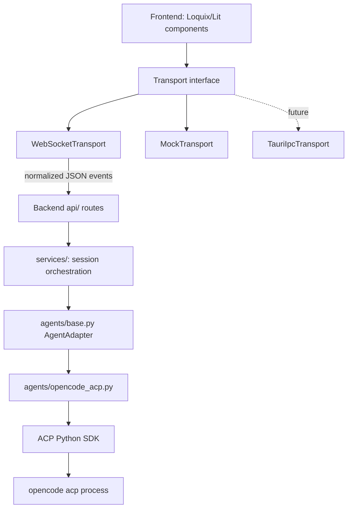
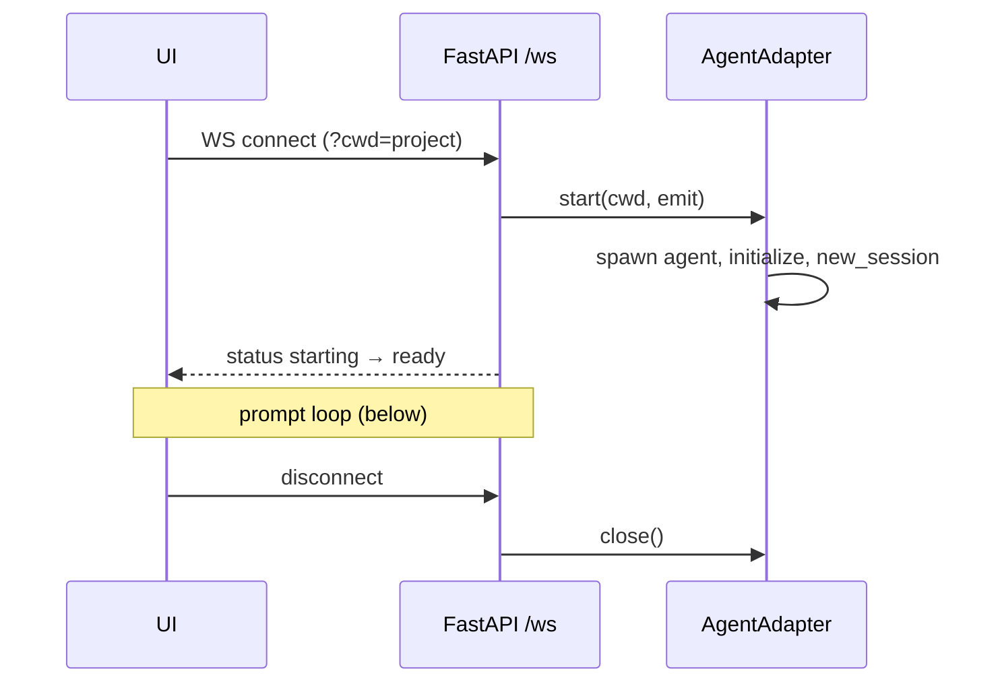
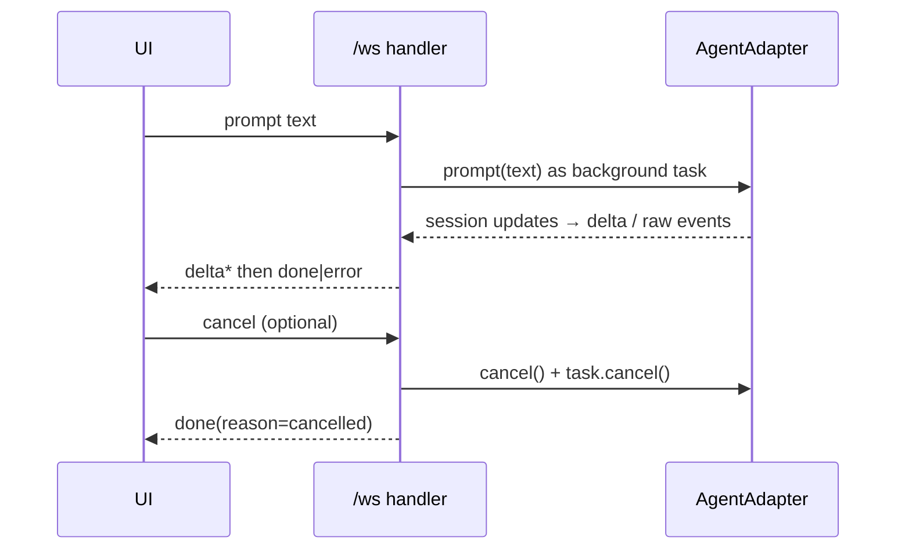

# Architecture

## Layers and dependency direction

Dependencies point inward/downward only. Nothing below an arrow may import from
above it.



- `frontend/src` never imports WebSocket globals directly; only `hooks/useChatSocket.ts` does.
- Backend application code depends on `AgentAdapter`, never on the ACP SDK or OpenCode.
- Phase 2A-A foundation: `base.py` is an ABC with capability snapshots and
  owned-process access (`capabilities.py`, `owned_process.py`, ADR-0007);
  routes obtain adapters only through an `AgentAdapterFactory` on `app.state`.
  Runtime capability discovery landed in Phase 2A-B behind two OpenCode
  adapters: `opencode/server_adapter.py` (headless HTTP server, preferred
  benchmark candidate) and `opencode_acp.py` (portable ACP v1), sharing
  `opencode/capability_mapper.py`. The active kind is selected by
  `RTAI_OPENCODE_ADAPTER`; unsupported capabilities surface as unavailable
  sections with exact reasons.
- Agent-native payloads cross the boundary only inside `raw` debug events.

## Backend layout

```
backend/app/
├── api/       HTTP + WebSocket routes (thin; no agent logic)
├── agents/    base.py contract + one folder-member per backend (opencode_acp.py)
├── core/      protocol helpers shared across layers
├── services/  session orchestration (introduced in Phase 2)
└── main.py    FastAPI factory, static mount for legacy POC UI
```

## Lifecycles

### Session lifecycle



One WebSocket = one agent session in Phase 0–1. Multi-session management arrives
with SQLite history (Phase 5).

### Prompt lifecycle



### Permission lifecycle

Agent requests permission → adapter emits `permission_request` → **current POC
always returns "cancelled"** (safety). Phase 4 adds a UI dialog that forwards a
real `permission_response`.

## Why Loquix

Framework-agnostic Web Components (Lit) with granular chat components
(message list, composer, tool roles, stop controls). Works in plain browser,
Tauri webview, or any host framework without adapters — matching the three
deployment targets. See ADR-0001.

## Why normalized agent events

The frontend must survive swapping OpenCode for another ACP agent (or another
protocol entirely). Normalizing at the adapter boundary keeps UI types stable,
makes mock transport trivial, and confines protocol churn to one Python module.
See ADR-0002.

## OpenCode process ownership (permanent rule)

The backend owns exactly one thing: the `opencode acp` child process it spawned
itself. See ADR-0006. The adapter records the owned PID/handle and ACP session
id; cancellation and teardown apply only to that session; scanning or killing
OpenCode processes by name is prohibited; a user's own OpenCode instances are
never started, discovered, reused, or terminated.

## Future boundaries

- **SQLite** (Phase 5): persistence lives behind a storage service; adapters and routes stay unaware.
- **Tauri** (Phase 6): replaces only the Transport implementation; zero component changes.
