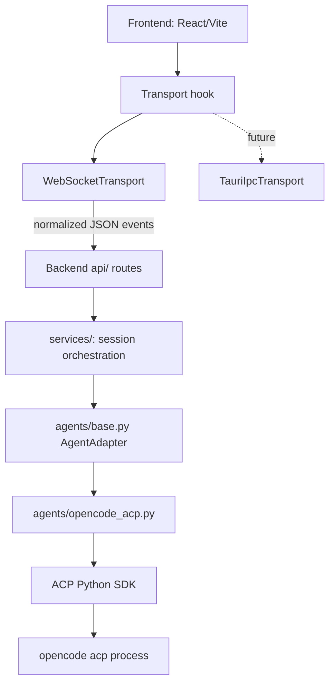
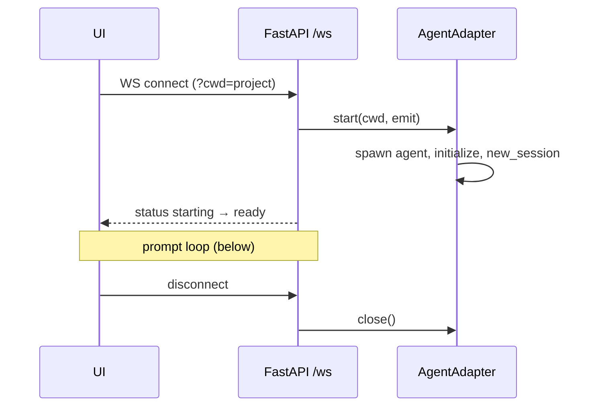
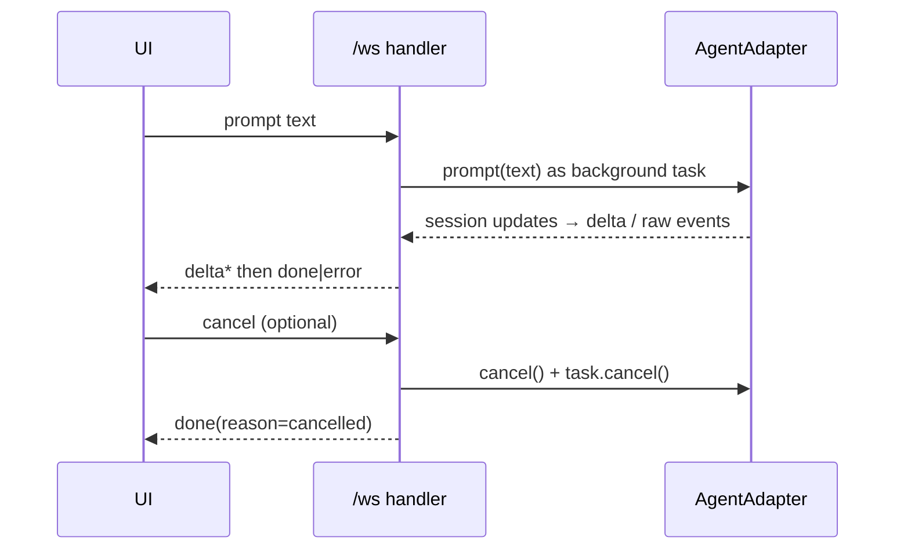

# Architecture

## Layers and dependency direction

Dependencies point inward/downward only. Nothing below an arrow may import from
above it.



- `frontend/src` never imports WebSocket globals directly; only `hooks/useChatSocket.ts` does.
- Backend application code depends on `AgentAdapter`, never on the ACP SDK or OpenCode.
- Phase 2A-A foundation: `base.py` is an ABC with capability snapshots and
  owned-process access (`capabilities.py`, `owned_process.py`, ADR-0007);
  routes obtain adapters only through an `AgentAdapterFactory` on `app.state`.
  Runtime capability discovery landed in Phase 2A-B behind two OpenCode
  adapters: `opencode/server_adapter.py` (headless HTTP server, preferred
  benchmark candidate) and `opencode_acp.py` (portable ACP v1), sharing
  `opencode/capability_mapper.py`. The active kind is selected by
  `RTAI_OPENCODE_ADAPTER`; unsupported capabilities surface as unavailable
  sections with exact reasons.
- Agent-native payloads cross the boundary only inside `raw` debug events.

## Backend layout

```
backend/app/
├── api/       HTTP + WebSocket routes (thin; no agent logic)
├── agents/    base.py contract + one folder-member per backend (opencode_acp.py)
├── core/      protocol helpers shared across layers
├── history/   SQLite session + transcript persistence (Phase 5)
├── services/  session orchestration (introduced in Phase 2)
└── main.py    FastAPI factory, static mount for the built React frontend
```

## Lifecycles

### Session lifecycle



One WebSocket = one agent session in Phase 0–1. Multi-session management arrives
with SQLite history (Phase 5).

### Prompt lifecycle



### Permission lifecycle

Agent requests permission → adapter emits `permission_request` → the UI shows
a dialog built from the request's options and forwards the user's choice as a
`permission_response`; the adapter resolves the pending request with that
option.

## Prompt content boundary

RTAI uses a **provider-neutral prompt content model** at the adapter
boundary. The frontend sends either a plain `text` string or an ordered
`prompt` array of content blocks (text, image, audio, resource links,
embedded resources). The shared ACP adapter (`agents/acp/session.py`)
validates each block against the negotiated ACP `promptCapabilities` and
converts to official SDK `ContentBlock` objects before dispatch.

```
WebSocket prompt command
        ↓
Protocol v1 validation (protocol_v1.py)
        ↓
RTAI PromptContent domain model (acp/prompt_content.py)
        ↓
Capability check + safety limits (5 MiB/item, 10 MiB total, 10 blocks)
        ↓
ACP SDK ContentBlock[] conversion
        ↓
agent.prompt(session_id, prompt=[...])
```

Key design decisions:

* **Resource links are ACP v1 baseline** — always supported unless the
  provider explicitly disables them.
* **Image/audio/embedded resources are capability-gated** — negotiated from
  `InitializeResponse.agent_capabilities.prompt_capabilities`.
* **RTAI owns its safety limits** — they are enforced regardless of what
  the provider advertises. No environment variable can force provider
  support that was not negotiated.
* **History is redacted** — persisted prompt metadata includes kind, name,
  MIME type, and byte size only; raw base64, embedded text, and file bytes
  are never stored.
* **The OpenCode HTTP/server adapter does not yet support attachments.**
  It reports `attachments_available.available = false` with reason
  `not_exposed_by_provider` because its REST API has no documented
  attachment schema. This is intentionally deferred to a separate task.

## Why React/Vite

The frontend is a React + Vite + TypeScript single-page app (Tailwind for
styling, assistant-ui primitives for the chat runtime). It talks to the backend
only through the normalized WebSocket protocol; the transport is isolated in
`frontend/src/hooks/useRtaiSocket.ts` so the UI never touches WebSocket
globals directly. The built output is produced by GitHub Actions and served
from `backend/app/static/dist/`.

## Why normalized agent events

The frontend must survive swapping OpenCode for another ACP agent (or another
protocol entirely). Normalizing at the adapter boundary keeps UI types stable,
makes mock transport trivial, and confines protocol churn to one Python module.
See ADR-0002.

## OpenCode process ownership (permanent rule)

The backend owns exactly one thing: the `opencode acp` child process it spawned
itself. See ADR-0006. The adapter records the owned PID/handle and ACP session
id; cancellation and teardown apply only to that session; scanning or killing
OpenCode processes by name is prohibited; a user's own OpenCode instances are
never started, discovered, reused, or terminated.

## Session history (Phase 5)

Backend-only persistent chat history lives in `backend/app/history/`. It is a
provider-neutral store: application code depends on the `HistoryRepository`
protocol (`history/repository.py`), never on SQLite directly.

### Storage location and configuration

- Data root: `RTAI_DATA_DIR` env var, else `Path.home() / ".rtai"`.
- Database file: `<data_root>/rtai.db` (with `rtai.db-wal` and `rtai.db-shm`
  alongside in WAL mode).
- Backups must either checkpoint SQLite or copy all three files together.

### Schema ownership and migrations

- Schema is owned by `history/migrations.py` (schema v1 + a migration runner).
- Every connection sets `PRAGMA journal_mode=WAL` (verified to return `wal`),
  `synchronous=NORMAL`, `foreign_keys=ON`, and `busy_timeout=5000`.
- Connections are per-operation (never one shared global connection across
  FastAPI threads); transactions are short and explicit.

### What is stored

- **Sessions**: server-assigned `rtai_session_id` (created once, before the
  first stored event), adapter kind, working directory, title, status, and
  timestamps. A partial unique index enforces one row per
  `(adapter_kind, native_session_id)` when a native id is present.
- **Transcript events**: normalized Protocol v1 conversation events, in order,
  each with a repository-assigned monotonic `event_ordinal` per session and a
  deterministic `event_key` for idempotent dedup. Persisted payloads are
  sanitized by an allowlist (`history/sanitize.py`) that keeps only trusted
  fields and drops credentials, raw provider payloads, process commands, and
  unsafe debug/data content.

### Event identity and deduplication

Every stored event gets a non-empty, deterministic `event_key` built from
stable protocol identity fields — never from timestamps and never from
Python's non-stable `hash()`. The key is `event_type | turn_id | message_id |
sequence | discriminator`, where:

- `sequence` is the protocol per-turn sequence where one exists (`delta`), or
  a session-local occurrence value for families that repeat without a wire
  sequence (`part_delta` chunks per part, `tool_update` per tool).
- `discriminator` is the stable per-family id: `tool_call_id` for tool events,
  `permission_request_id` for permission events, `part_id` for part events.

This guarantees that legitimate separate events never collapse (multiple tool
calls in a turn, repeated tool updates, and repeated part deltas are all
preserved). Re-appending the same `event_key` for a session deduplicates
(idempotent no-op), but separate persistence calls produce separate events:
for occurrence-based families (`part_delta`, `tool_update`) each call
increments the session-local counter and yields a new key, so there is no
cross-call retry-key reuse. Occurrence values are assigned once, before the
database write, and are persistence-only — they are never exposed on the
WebSocket wire. Atomic per-session ordering is provided by the
repository-assigned `event_ordinal`, independent of the identity key.

> **Limitation:** events already lost to the earlier collision behavior (when
> the key omitted the discriminator/occurrence) cannot be reconstructed from
> the database. Only the first event per collided key was stored.

### Transcript vs. resume

Persisting a transcript is **not** the same as resuming a session. Native
continuation (re-attaching to a live agent session) is deferred to a later
phase. This phase records capability state only: whether the active adapter
exposes session load/list/resume/close, surfaced through the existing
`CapabilitySnapshot.sessions` field. The UI disables resume when the provider
does not expose it.

### REST read APIs

- `GET /api/sessions` — list sessions (keyset pagination).
- `GET /api/sessions/{session_id}` — session detail.
- `GET /api/sessions/{session_id}/events` — transcript events (keyset
  pagination by `(event_ordinal, id)`).

#### Ordering

- Sessions are ordered newest-first by `(updated_at, rtai_session_id)`.
- Events are ordered by `(event_ordinal, id)` within a session.

#### Cursors and limits

- Pagination cursors are opaque, URL-safe base64 strings with a single
  explicit format version (`v1`). They are an internal contract, not a
  client-editable one: clients must treat them as opaque and only echo back a
  cursor returned by the API.
- A session-list cursor encodes `(updated_at, rtai_session_id)`; an event-list
  cursor encodes `(event_ordinal, id)` — the exact fields of the ordering,
  including the deterministic tie-breaker.
- An empty or absent cursor means the first page.
- Any non-empty malformed cursor (bad base64, bad UTF-8, missing/extra fields,
  unknown version, non-numeric or empty identifiers) is rejected with HTTP 400
  (`{"error": {"code": "invalid_cursor", ...}}`). It is never silently treated
  as the first page.
- `limit` must be an integer within `[1, max]` (200 for sessions, 500 for
  events). Non-numeric, zero, negative, or over-maximum values are rejected
  with HTTP 400 (`{"error": {"code": "invalid_limit", ...}}`); they are never
  silently clamped.
- Unknown session ids return HTTP 404; internal repository failures are not
  reported as 400.

### Adapter matrix

| Adapter | Session capability reporting |
|---|---|
| OpenCode ACP (`opencode_acp.py`) | Mapped from ACP `agent_capabilities` |
| OpenCode Server (`opencode/server_adapter.py`) | `NOT_EXPOSED_BY_PROVIDER` (no list/load/resume endpoints) |

## Future boundaries

- **Tauri** (Phase 6): replaces only the Transport implementation; zero component changes.
