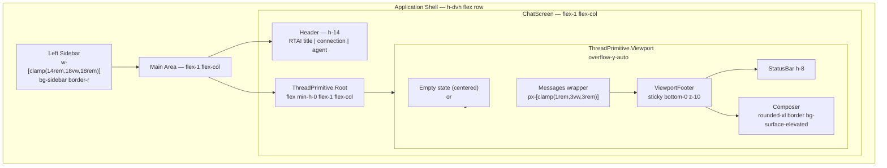

# RTAI Frontend UI Specification

## 1. Purpose and scope

This document defines the complete visual and layout specification for the RTAI frontend.
It is grounded in OpenChamber's real application shell as observed from source, but RTAI
retains its own backend, protocol (v1), runtime capability system, and assistant-ui dependency.

OpenChamber is the **reference** for application-shell anatomy, message rail behavior,
sidebar patterns, composer layout, and responsive breakpoints. It is not a code template;
RTAI must never copy OpenChamber source. All measurements below are derived from reading
OpenChamber's actual component hierarchy and CSS.

Locked RTAI principles this specification must preserve:
- React/Vite frontend with TypeScript.
- `@assistant-ui/react` primitives (ThreadRoot, Viewport, ViewportFooter, ComposerPrimitive).
- Tailwind CSS v4 utilities only; no `@apply`, no CSS Modules, no CSS-in-JS.
- Semantic tokens via `@theme inline` in `frontend/src/styles/themes.css`.
- Runtime-driven capabilities; no hardcoded agent/model/mode/thinking values.
- Exactly one Thread Root, Viewport, ViewportFooter, and Composer per chat panel.
- Coding and testing remain separate agent responsibilities.
- No local Node/npm/Bun build; GitHub Actions performs builds and tests.
- Bounded-fluid layout: the shell fills the viewport; the chat content rail is a
  centered fluid column with a documented maximum.

## 0. Locked implementation contract

These rules are **non-negotiable**. No agent may redesign, bypass, or replace them
during implementation. Any deviation requires an explicit change to this document first.

| Rule | Locked value |
|---|---|
| Shell height | Full viewport: `h-dvh` (`min-h-0 w-full overflow-hidden`) |
| Header height | `h-14` (56px), `shrink-0`, `flex items-center justify-between` |
| Left sidebar width | `w-[clamp(14rem,18vw,18rem)]` — desktop static column |
| Left sidebar mobile (< 768px) | Off-canvas drawer: `max-md:fixed max-md:inset-y-0 max-md:left-0 max-md:z-40 max-md:w-[min(85vw,20rem)]` |
| Assistant prose column | `max-w-[48rem]` (768px) centered with `mx-auto`; `px-[clamp(1rem,3vw,3rem)]` gutters |
| Composer input column | `w-full`, no max-width cap; sits inside ViewportFooter at `sticky bottom-0 z-10` |
| Tool / code overflow | May exceed prose column width; must never create page-level horizontal scroll — use `overflow-x-auto` within the card |
| Scroll ownership | Exactly one scrolling region: `ThreadPrimitive.Viewport` (`overflow-y-auto`). No other ancestor may scroll. |
| Thread structure | Exactly one `ThreadPrimitive.Root`, one `Viewport`, one `ViewportFooter`, one Composer |
| Styling discipline | Tailwind v4 semantic utilities only; no raw `var(--...)` in className; no `@apply`; no CSS Modules |
| Capability controls | Driven entirely by runtime events from the backend; no hardcoded agent/model/mode/thinking lists |

## 2. Reference evidence

| Area | OpenChamber source | Observed behavior | RTAI decision | Reason |
|---|---|---|---|---|
| Application shell height | `packages/ui/src/components/layout/MainLayout.tsx:102` | `h-[100dvh]`, overflow hidden, no page scroll | Use `h-dvh` with `overflow-hidden` on root div | Matches existing STYLING.md contract; dvh handles mobile URL-bar collapse |
| Left sidebar width | `packages/ui/src/components/layout/Sidebar.tsx:7-9` | `SIDEBAR_CONTENT_WIDTH = 280`, min 280, max 500, resizable via pointer events | Fixed `w-[clamp(14rem,18vw,18rem)]` (224px-288px) | RTAI has no need for resizable sidebar; clamp gives proportional desktop width without runtime resize logic |
| Left sidebar mobile | `packages/ui/src/components/layout/Sidebar.tsx:60-61` | Returns `null` on mobile; mobile uses separate shell | Drawer at `max-md:fixed` with backdrop, as already in Sidebar.tsx | Matches existing implementation; preserves current behavior |
| Header height | `packages/ui/src/components/layout/Header.tsx:1565` | `h-12` (48px) on desktop; macOS 26 uses `h-12`, macOS 15 and below `h-14` | `h-14` (56px) fixed | Simpler for RTAI; matches existing ChatScreen header |
| Header alignment | `packages/ui/src/components/layout/Header.tsx:1565` | `flex items-center`, session title left, controls right | Keep flex row, `items-center`, `justify-between` | Current pattern works |
| Main chat area sizing | `packages/ui/src/components/layout/MainLayout.tsx:130-131` | `flex flex-1 min-h-0 overflow-hidden` | Same: `flex-1 min-h-0 overflow-hidden` | Required for flex shrink chain |
| Chat content rail width | `packages/ui/src/styles/typography.css:84-87` | `.chat-column { width: min(100%, 48rem); margin-inline: auto; padding-inline: clamp(0.75rem, 2.5vw, 1rem) }` | `w-full min-w-0` with shared gutter `px-[clamp(1rem,3vw,3rem)]`; no max-width wrapper on the rail itself | RTAI uses full-width rail with gutters; avoids max-w-3xl/4xl/5xl per STYLING.md |
| Message rail readable measure | `packages/ui/src/styles/typography.css:225-227` | `.chat-message-column { width: min(100%, 48rem) }` unlayered duplicate for robustness | Messages fill rail width (gutter-clamped); long code blocks scroll horizontally | Code blocks exceed text measure; horizontal scroll is intentional |
| Composer position | `packages/ui/src/components/chat/ChatContainer.tsx:1462-1472` | Composer lives in a `data-composer-bound` slot below the scroll viewport; sticky footer pattern | Composer inside `ThreadPrimitive.ViewportFooter` as already implemented | Preserves assistant-ui contract; one scroll region |
| Composer footer layout | `packages/ui/src/components/chat/composer/ui/ComposerFooter.tsx:192-256` | Desktop: attachments toggles left, model controls + send right; mobile: single row | Keep single-row footer with capability controls left-aligned | Current CapabilityControls component matches this pattern |
| Empty state centering | `packages/ui/src/components/chat/ChatContainer.tsx:1316-1327` | `flex flex-col h-full bg-background` with centered `ChatEmptyState` | `flex min-h-0 flex-1 flex-col items-center justify-center` with heading + subtext | Already implemented in ChatScreen.tsx |
| Right context panel | `packages/ui/src/components/layout/ContextPanel.tsx:52-54` | Min 380px, max 1400px, default 600px; resizable | Deferred to future milestone; define target only | No backend session-management API exists yet |
| Right action rail | `packages/ui/src/components/layout/ContextPanelRail.tsx:294` | `w-11` (44px), vertical icon strip with drag-to-reorder | Deferred; define target only | Requires context surface registry not yet in RTAI |
| Scroll ownership | `packages/ui/src/components/chat/ChatContainer.tsx:408` | Single `overflow-y-auto` on timeline scroll container; `overflowAnchor: none` | `ThreadPrimitive.Viewport` owns scroll (`overflow-y-auto`); no other ancestor scrolls | Matches existing ChatScreen implementation |
| Breakpoint for sidebar mobile | `packages/ui/src/styles/mobile.css:4` | `@media (max-width: 1024px)` for mobile adaptations | Tailwind `md` (768px) for sidebar drawer toggle | Existing implementation already uses `md:hidden` for menu button |
| Typography base size | `packages/ui/src/styles/design-system.css:27-28` | `--text-markdown: 0.9375rem`, `--text-code: 0.8125rem` | Match these exact values | Shared design language; identical token definitions in RTAI themes.css |
| Focus ring | `packages/ui/src/styles/design-system.css:188-203` | Global `outline: none` except explicit `.focus-ring-accent`; 2px solid primary ring | Keep RTAI's `:focus-visible { outline: 2px solid var(--ring); outline-offset: 2px }` | RTAI uses semantic `--ring` token; consistent with existing base.css |

## 3. Application anatomy

### Hierarchy

```
#root (height: 100%; overflow: hidden; background: var(--background))
  └── App shell <div>  flex h-dvh min-h-0 w-full min-w-0 overflow-hidden
       ├── <Sidebar />         w-[clamp(14rem,18vw,18rem)] bg-sidebar border-r border-border shrink-0 overflow-hidden
       │    (max-md: fixed drawer, see STYLING.md)
       └── <main>             flex min-h-0 min-w-0 flex-1 flex-col overflow-hidden
            └── <ChatScreen>   flex min-h-0 min-w-0 flex-1 flex-col
                 ├── <header>   h-14 shrink-0 flex items-center border-b border-interactive bg-surface-background px-4
                 │    Menu button (md:hidden) | RTAI title | connection dot | agent label
                 └── ThreadPrimitive.Root  flex min-h-0 min-w-0 w-full flex-1 flex-col
                      └── ThreadPrimitive.Viewport  flex min-h-0 min-w-0 flex-1 flex-col overflow-y-auto
                           ├── Empty state (when thread.isEmpty)
                           │    flex min-h-0 flex-1 flex-col items-center justify-center
                           │    px-[clamp(1rem,3vw,3rem)] text-center
                           ├── Messages wrapper (bounded fluid column)
                           │    w-full min-w-0
                           │    message-column: max-w-[48rem] mx-auto px-[clamp(1rem,3vw,3rem)]
                           │    <ThreadPrimitive.Messages>
                           └── ThreadPrimitive.ViewportFooter  sticky bottom-0 z-10 w-full min-w-0 bg-background
                                ├── <StatusBar />  h-8 flex items-center gap-2 border-t
                                └── <Composer />     w-full min-w-0 rounded-xl border bg-surface-elevated
```

### Mermaid layout diagram



### Component inventory

| Component | Role | Milestone |
|---|---|---|
| `App.tsx` | Shell root: Sidebar + ChatPanel | Shell |
| `Sidebar.tsx` | Left navigation: theme toggle, project folder, session list, footer controls | Shell / Left sidebar |
| `ChatPanel.tsx` | Wraps ChatScreen in flex main | Shell |
| `ChatScreen.tsx` | Header + ThreadPrimitive hierarchy | Shell / Main thread |
| `OpenChamberChat.tsx` | Re-export alias for ChatScreen | (existing, may be removed) |
| `Composer.tsx` | ComposerPrimitive with input + send/stop + CapabilityControls | Composer |
| `CapabilityControls.tsx` | Runtime-driven agent/model/mode/thinking selectors | Composer |
| `Message.tsx` | Per-message rendering: user bubble + assistant card with ToolCard | Message rendering |
| `ToolCard.tsx` | Collapsible tool call card with icon, preview, expanded output | Message rendering |
| `StatusBar.tsx` | Connection indicator + agent label + last error | Main thread |

## 4. Size system

### Breakpoints (Tailwind v4 defaults)

| Token | Value |
|---|---|
| `sm` | 640px |
| `md` | 768px |
| `lg` | 1024px |
| `xl` | 1280px |
| `2xl` | 1536px |

RTAI uses these exact breakpoints; no custom breakpoints are defined.

### Dimension table

| Element | Narrow (<768px) | Normal desktop (1024–1440px) | Wide desktop (1441–1920px) | Very wide (>1920px) |
|---|---|---|---|---|
| Header height | 3.5rem (56px) | 3.5rem (56px) | 3.5rem (56px) | 3.5rem (56px) |
| Left sidebar width | Drawer: min(85vw, 20rem) | clamp(14rem, 18vw, 18rem) | clamp(14rem, 18vw, 18rem) | clamp(14rem, 18vw, 18rem) |
| Left sidebar collapsed | N/A (hidden) | 0 (drawer closed) | 0 (drawer closed) | 0 (drawer closed) |
| Right sidebar width | N/A (deferred) | N/A | N/A | N/A |
| Right rail width | N/A (deferred) | N/A | N/A | N/A |
| Main min width | 0 (sidebar drawer covers) | 0 (fluid) | 0 (fluid) | 0 (fluid) |
| Content-rail formula | Messages: `max-w-[48rem] mx-auto` + `px-[clamp(1rem,3vw,3rem)]`; Composer: `w-full` | Same dual-column pattern | Same dual-column pattern | Same dual-column pattern |
| Horizontal gutters | min 1rem, scales to 3rem at wide | clamp(1rem, 3vw, 3rem) | clamp(1rem, 3vw, 3rem) | clamp(1rem, 3vw, 3rem) |
| Composer min height | 3.75rem (single row textarea + footer) | 3.75rem | 3.75rem | 3.75rem |
| Composer default height | 5rem (before auto-grow) | 5rem | 5rem | 5rem |
| Composer max height | 200px input + 2.5rem footer | 200px input + 2.5rem footer | 200px input + 2.5rem footer | 200px input + 2.5rem footer |
| Drawer width (mobile) | min(85vw, 20rem) | N/A | N/A | N/A |
| Message-column max width | `max-w-[48rem]` (768px) centered with gutters | `max-w-[48rem]` centered with gutters | `max-w-[48rem]` centered with gutters | `max-w-[48rem]` centered with gutters |
| Composer width | `w-full` (fills entire rail, no cap) | `w-full` (fills entire rail, no cap) | `w-full` (fills entire rail, no cap) | `w-full` (fills entire rail, no cap) |

### Content-rail formula (dual-column: bounded message + fluid composer)

The chat content area uses a **dual-column** layout inspired by OpenChamber's
`.chat-column` / `.chat-input-column` pattern:

- **Message column**: bounded fluid column, `max-w-[48rem]` (768px) centered with
  `mx-auto`, padded with `px-[clamp(1rem,3vw,3rem)]`. This ensures prose readability
  at all viewport widths while allowing code blocks and tool cards to exceed the
  text measure and scroll horizontally.
- **Composer**: full-width (`w-full`), no max-width cap. The composer benefits from
  wide screens for the capability controls bar and provides maximum typing space.

```
message-column:  max-w-[48rem] mx-auto, px-[clamp(1rem,3vw,3rem)]
  -> at 320px:   ~288px content (max-w constrains to viewport)
  -> at 1024px:  ~768px content (48rem cap active)
  -> at 1920px:  ~768px content (48rem cap active)
  -> at 2560px:  ~768px content (48rem cap active)

composer:        w-full, no max-width
  -> at 320px:   ~288px (gutter-clamped)
  -> at 1024px:  ~730px (sidebar 294px removed from main)
  -> at 1920px:  ~1584px (sidebar 288px removed from main)
  -> at 2560px:  ~2224px (sidebar 288px removed from main)
```

**Why this dual-column approach:**
- Prose remains at a comfortable ~768px maximum across all desktop widths (optimal
  reading measure per typographic research).
- Code blocks and tool cards scroll horizontally within their container -- this is
  intentional and matches OpenChamber's `.chat-message-column` pattern.
- The composer benefits from full width: capability controls have room to lay out
  in a single row, and the input area feels spacious at any viewport size.
- The gutter itself is fluid: it tightens on narrow screens for precious content
  width and expands on wide screens to prevent content from touching the sidebar
  or screen edge.

### Horizontal gutter formula

```
padding-inline = clamp(1rem, 3vw, 3rem)
```

This is applied to:
- The messages wrapper inside Viewport (inside the max-w-[48rem] column)
- The ViewportFooter inner wrapper (status bar + composer)
- The empty state container

The composer card itself owns **no** additional page gutter -- it sits inside the
footer gutter wrapper and uses `w-full min-w-0`.

## 5. Typography system

All typography tokens are defined in `frontend/src/styles/themes.css` and exposed via `@theme inline`.
Components reference them through Tailwind semantic utilities; the markdown.css exception file
handles generated Markdown descendants.

### Font families

| Role | Value | Source |
|---|---|---|
| Sans-serif (default) | `"SF Pro Text", -apple-system, BlinkMacSystemFont, "Segoe UI", system-ui, sans-serif` | `--font-sans` in themes.css |
| Monospace (code) | `ui-monospace, SFMono-Regular, Menlo, Cascadia Mono, "Segoe UI Mono", monospace` | `--font-mono` in themes.css |

### Type scale

| Role | Size | Weight | Line height | Token |
|---|---|---|---|---|
| Assistant message text / Markdown body | 0.9375rem (15px) | 400 | 1.6 | `--text-markdown` |
| User message text | 0.9375rem (15px) | 400 | 1.6 | Same as assistant |
| Composer input | 0.875rem (14px) | 400 | 1.5 | Tailwind `text-sm` |
| Sidebar section labels | 0.75rem (12px) | 500 | 1.2 | Uppercase tracking-widest |
| Session titles (header) | 0.9375rem (15px) | 400 | 1.4 | `text-[14px] font-normal leading-tight` |
| Capability controls | 0.75rem (12px) | 400 | 1.3 | `text-xs` |
| Metadata / status text | 0.75rem (12px) | 400 | 1.3 | `text-xs text-muted-foreground` |
| Empty state heading | 1.5rem (24px) | 400 | 1.3 | `text-2xl font-normal` |
| Empty state subtext | 0.875rem (14px) | 400 | 1.5 | `text-sm text-muted-foreground` |
| Code / inline code | 0.8125rem (13px) | 400 | 1.5 | `--text-code` |
| Micro text | 0.8125rem (13px) | 400 | 1.4 | `--text-micro` |
| Tool card title | 0.875rem (14px) | 500 | 1.4 | `text-sm font-medium` |
| Tool card meta | 0.75rem (12px) | 400 | 1.3 | `text-xs` |

### Differences from OpenChamber

OpenChamber uses the same base sizes (`--text-markdown: 0.9375rem`, `--text-code: 0.8125rem`).
RTAI differs in:
- No `--text-ui-header` token needed; RTAI headers use standard Tailwind utilities.
- No mobile pointer font-size overrides; RTAI keeps consistent sizes across breakpoints.
- Simpler weight hierarchy: 400 for body, 500 for labels/titles, 600 only for strong/emphasis.

## 6. Colour and surface system

All colors map to semantic tokens in `frontend/src/styles/themes.css`. Components use
Tailwind utility classes like `bg-background`, `text-foreground`, `border-interactive` -- never
raw `var(--...)` in className strings.

### Semantic token mapping

| Role | Light token | Dark token | Tailwind utility |
|---|---|---|---|
| App background | `--background: oklch(0.97 0.02 85)` | `--background: oklch(0.16 0.01 30)` | `bg-background` |
| Primary text | `--foreground: oklch(0.25 0.02 40)` | `--foreground: oklch(0.85 0.02 90)` | `text-foreground` |
| Sidebar background | `--sidebar: oklch(0.94 0.015 80)` | `--sidebar: oklch(0.18 0.01 40)` | `bg-sidebar` |
| Sidebar text | `--sidebar-foreground` | `--sidebar-foreground` | `text-sidebar-foreground` |
| Elevated surface (composer, cards) | `--surface-elevated = var(--card): oklch(0.99 0.01 90)` | `--surface-elevated: oklch(0.19 0.01 40)` | `bg-surface-elevated` |
| Muted surface | `--surface-muted: oklch(0.9 0.015 75)` | `--surface-muted: oklch(0.33 0.01 40)` | `bg-surface-muted` |
| Border | `--border: oklch(0.85 0.02 70)` | `--border: oklch(0.31 0.01 35)` | `border-border` |
| Interactive border | `--interactive-border: var(--border)` | `--interactive-border: var(--border)` | `border-interactive` |
| Interactive hover | `color-mix(in srgb, var(--primary) 10%, transparent)` | `--interactive-hover` | `hover:bg-interactive-hover` |
| Primary accent | `--primary: oklch(0.65 0.2 55)` (warm orange) | `--primary: oklch(0.77 0.17 85)` (golden sand) | `bg-primary` |
| Primary foreground | `--primary-foreground: oklch(0.99 0.01 90)` | `--primary-foreground: oklch(0.16 0.01 30)` | `text-primary-foreground` |
| Muted text | `--muted-foreground: oklch(0.45 0.02 50)` | `--muted-foreground: oklch(0.75 0.02 80)` | `text-muted-foreground` |
| Focus ring | `--ring: oklch(0.65 0.2 55)` | `--ring: oklch(0.77 0.17 85)` | `focus:ring-ring` |
| Success | `--status-success: oklch(0.58 0.15 145)` | `--status-success` | `bg-status-success` |
| Warning | `--status-warning: oklch(0.75 0.18 85)` | `--status-warning` | `bg-status-warning` |
| Error | `--status-error: oklch(0.58 0.22 25)` | `--status-error` | `bg-status-error` |
| Info | `--status-info: oklch(0.62 0.18 230)` | `--status-info` | `bg-status-info` |
| Chat user message bg | `color-mix(in srgb, var(--primary) 12%, transparent)` | `color-mix(in srgb, var(--primary) 20%, transparent)` | `bg-chat-user-message-bg` |
| Tools background | `color-mix(in srgb, var(--surface-muted) 30%, transparent)` | `--tools-background` | `bg-tools-background` |
| Tools border | `color-mix(in srgb, var(--interactive-border) 60%, transparent)` | `--tools-border` | `border-tools-border` |
| Tools icon | `var(--surface-muted-foreground)` | `oklch(0.75 0.02 80)` | `text-tools-icon` |
| Tools title | `var(--surface-foreground)` | `var(--tools-title)` | `text-tools-title` |
| Markdown link | `color-mix(in srgb, var(--status-info) 90%, var(--primary))` | color-mixed variant | via markdown.css |
| Markdown inline code | `var(--markdown-inline-code): oklch(0.58 0.15 145)` | `--markdown-inline-code` | Inline code style |
| Markdown inline code bg | `color-mix(in srgb, var(--surface-muted) 80%, transparent)` | `--markdown-inline-code-bg` | Inline code bg |

### Missing semantic tokens to add (no source change required by this spec)

The following roles are used in components but lack dedicated tokens in themes.css:
- `--interactive-focus-ring`: Already exists (`color-mix(in srgb, var(--primary) 50%, transparent)`)
- `--chat-assistant-message-bg`: Already mapped to `var(--surface-background)`
- `--chat-assistant-message`: Already mapped to `var(--surface-foreground)`
- `--tools-header-hover`: Already exists
- `--tools-description`: Already exists

All required semantic tokens are present. No token additions are blocking.

## 7. Left sidebar specification

### Desktop layout

- **Width**: `w-[clamp(14rem,18vw,18rem)]` (224px minimum, scales proportionally, 288px maximum).
- **Background**: `bg-sidebar text-sidebar-foreground`.
- **Border**: `border-r border-border` on the right edge.
- **Shrink**: `shrink-0` -- sidebar never compresses when main area is narrow.
- **Overflow**: `overflow-hidden` -- content scrolls within the sidebar, not the app shell.

### Structure (top to bottom)

```
+-----------------------------+
|  Logo / title  | [theme]    |  <- flex justify-between, p-4, border-b
+-----------------------------+
|  Project folder input       |  <- label + input, p-4, border-b
+-----------------------------+
|                             |
|  Session list               |  <- flex-1 overflow-y-auto, p-4
|  (empty: "No sessions")     |
|                             |
+-----------------------------+
|  [reconnect]  [new session] |  <- flex justify-center gap-2, p-4, border-t
+-----------------------------+
```

### Workspace / project presentation

- A single project-folder text input at the top (below the header strip).
- Label: uppercase, 12px, tracking-widest, opacity-70.
- Input: full width, rounded-lg, border-border, bg-background, text-sm.
- On Enter: persists to localStorage.

### Session list

- Container: `flex-1 overflow-y-auto p-4`.
- Each session item: truncating title, right-aligned status dot.
- Active session: `bg-interactive-hover` background, subtle left border accent.
- Empty state: centered "No sessions" text, min-h-[200px].
- Phase 5 will replace this with SQLite-backed session list.

### Active session indicator

- Highlighted with `bg-interactive-hover` (10% primary mix).
- Right edge shows a 2px `border-l border-primary` accent when active.

### Footer controls

- Two icon buttons: RefreshCw (reconnect) and Plus (new session).
- Spaced with `gap-2`, centered with `justify-center`.
- 32x32px touch target (w-8 h-8), rounded-lg, hover:bg-interactive-hover.
- Titles for tooltips.

### Collapse / drawer behavior

- **Desktop**: Sidebar is always visible as a static column.
- **Mobile (< 768px)**: Sidebar becomes an off-canvas drawer:
  - `max-md:fixed max-md:inset-y-0 max-md:left-0 max-md:z-40`
  - `max-md:w-[min(85vw,20rem)]`
  - `max-md:transition-transform max-md:duration-200 max-md:shadow-xl`
  - Open: `max-md:translate-x-0`; Closed: `max-md:-translate-x-full`
- **Backdrop**: `fixed inset-0 z-30 bg-foreground/50 md:hidden` rendered only when open.
- Clicking backdrop or pressing Escape closes drawer and restores focus to menu button.

### Scroll ownership

- Sidebar scroll is independent: `overflow-y-auto` on the session list container.
- The app shell has exactly one scrolling region: `ThreadPrimitive.Viewport`.
- Sidebar scroll never interferes with chat scroll.

### Keyboard and focus behavior

- Menu button (`md:hidden`) has `aria-expanded`, `aria-controls="app-sidebar"`, `aria-label`.
- Escape key closes drawer and calls `menuButtonRef.current?.focus()`.
- Focus trap is **not** implemented (deferred to Phase 8 accessibility polish).
- Tab order: menu button -> sidebar contents -> main chat area.

## 8. Main thread specification

### Header

- **Height**: `h-14` (56px), `shrink-0`.
- **Background**: `bg-surface-background`.
- **Border**: `border-b border-interactive`.
- **Padding**: `px-4`.
- **Layout**: `flex items-center justify-between`.

**Left side**:
- Menu button: `md:hidden`, 32x32px, rounded-lg, border-border, hover:bg-interactive-hover.
- RTAI title: `text-lg font-medium text-foreground`.
- Connection dot: 8x8px rounded-full, `bg-status-success` when connected, `bg-status-error` when disconnected.

**Right side**:
- Agent info label: `ml-auto text-sm text-muted-foreground`, sourced from `agentInfo` store.

### Empty state

Rendered when `ThreadPrimitive` reports `thread.isEmpty` (via `AuiIf`):

```
flex min-h-0 flex-1 flex-col items-center justify-center
px-[clamp(1rem,3vw,3rem)] text-center
```

- Heading: `text-2xl font-normal text-foreground` -- "What are we working on?"
- Subtext: `mt-2 text-sm text-muted-foreground` -- "Start a conversation with the AI assistant"
- Vertically centered in the remaining Viewport space.

### Short conversation (few messages)

- Messages flow naturally; Viewport scrolls to show newest content.
- Auto-scroll keeps viewport at bottom when user is within 200px of the bottom.
- No artificial padding at bottom; the ViewportFooter (status + composer) sits below.

### Long conversation

- Viewport is the sole scroll region: `overflow-y-auto`.
- Auto-scroll uses `MutationObserver` on childList + subtree to detect new content.
- User who has scrolled up more than 200px from bottom is not forced back down.
- No history loading (Phase 5 backend REST API will enable this later).

### Streaming state

- Assistant message text grows char-by-char via `delta` events.
- Composer shows Stop button (`isRunning` from store); Send button hidden.
- StatusBar shows pulsing warning dot while running:
  `animate-[busy-pulse_1.2s_ease-in-out_infinite] bg-status-warning`
- Tool cards show running state with pulsing bullet: `animate-[busy-pulse_...]`.

### Message spacing

- Inter-message vertical gap: `py-2` on MessagePrimitive.Root (8px top and bottom).
- User message: right-aligned (`flex-row-reverse`), max-w-[75%] bubble.
- Assistant message: left-aligned, full-width card with border.

### User / assistant alignment

| Role | Alignment | Bubble style | Avatar |
|---|---|---|---|
| User | Right (`flex-row-reverse`) | `max-w-[75%] self-end rounded-xl p-2.5 bg-chat-user-message-bg border border-primary/20` | 28x28 circle, `bg-surface-muted text-surface-muted-foreground`, label "U" |
| Assistant | Left | `w-full bg-card border border-border rounded-xl p-2.5` | 28x28 circle, `bg-primary text-primary-foreground`, label "AI" |

### Readable text measure

The message column uses a **dual-column** layout:
- **Messages**: `max-w-[48rem]` (768px) centered with `mx-auto`, plus `px-[clamp(1rem,3vw,3rem)]` gutters.
  This caps prose at a comfortable reading width at all viewport sizes.
- **Composer**: `w-full`, no max-width -- fills the full rail width for spacious input.
- Code blocks and tool cards scroll horizontally within the message column.
- At 1920px the message column is 768px (fixed cap); the composer is ~1584px wide.

### Tool / code width behavior

- Tool cards: `w-full` within the message card; expanded output scrolls horizontally.
- Code blocks (`pre`): `overflow-x-auto` with `min-w-100%`; horizontal scroll is expected.
- No word-wrapping on code; `white-space: pre` preserves formatting.
- User message text: `overflow-wrap: break-word` for long strings.

### Scroll-to-bottom behavior

- **Auto-scroll**: MutationObserver on Viewport; triggers when `scrollHeight - scrollTop - clientHeight < 200`.
- **On send**: New user message triggers scroll to bottom (via MutationObserver).
- **During streaming**: Auto-scroll continues to follow new deltas.
- **User scroll-up**: Auto-scroll pauses; a "Scroll to bottom" glass pill floats above the composer (see section 14).

## 9. Composer specification

### Position

Inside `ThreadPrimitive.ViewportFooter`, which is `sticky bottom-0 z-10 w-full min-w-0 bg-background`.
The footer contains: StatusBar (above) + Composer (below), both wrapped in
`px-[clamp(1rem,3vw,3rem)]` gutter div.

### Shared rail alignment

The composer aligns with the message content rail via the shared gutter wrapper:
- Gutter wrapper: `div.px-[clamp(1rem,3vw,3rem)]` (ViewportFooter inner)
  - StatusBar: h-8 flex items-center gap-2 border-t
  - Composer: w-full min-w-0 rounded-xl border bg-surface-elevated

### Width formula

`w-full min-w-0` -- fills the gutter-clamped rail width exactly. No `max-w` wrapper.

### Surface, border, radius

- Background: `bg-surface-elevated` (card color, slightly elevated from background).
- Border: `border border-interactive` (1px, semantic border token).
- Radius: `rounded-xl` (12px).
- Focus ring: `focus-within:ring-2 focus-within:ring-interactive-focus-ring`.

### Internal padding

- Input area: `p-3` (12px all sides) on the root flex container.
- Input field: `px-1 py-1.5` (4px left/right, 6px top/bottom) -- tight padding for text area.
- Footer row: `px-3 pb-2` (12px horizontal, 8px bottom).

### Input minimum and maximum height

- Minimum: `rows={1}` -- single line, approximately 36px height.
- Maximum: 200px via inline style (`Math.min(el.scrollHeight, 200)`).
- Auto-grow: `onInput` handler sets `style.height = "auto"` then `style.height = min(scrollHeight, 200}px")`.
- Overflow: `overflow-y-auto` when content exceeds max height.

### Top / bottom row arrangement

Row 1 (input row):
- ComposerPrimitive.Input (flex-1, resize-none) + Send/Stop button (shrink-0, 36x36px).
- Container: `flex items-end gap-2 p-3`.

Row 2 (footer row):
- CapabilityControls component, left-aligned with `flex-wrap`.
- Container: `flex items-center justify-between gap-2 px-3 pb-2`.

### Runtime-control order

Left to right in the capability footer:
1. Agent (Bot icon) -- dropdown if >1 agent, chip if exactly 1, omitted if none.
2. Model (Cpu icon) -- dropdown if available, empty/disabled chip if unavailable.
3. Mode (Layers icon) -- same tri-state pattern.
4. Thinking (Brain icon) -- rendered only when runtime supplies levels.

Each control is a 12px-height chip with icon + label + optional pending spinner.

### Long-label handling

- Control labels truncate at `max-w-[10rem]` (160px).
- `title` attribute shows full description for tooltips.
- Uses `truncate` class for ellipsis.

### Wrapping / collapse strategy

- Capability controls use `flex flex-wrap gap-1`.
- When controls exceed available width, they wrap to the next line.
- No collapse into a "more" menu -- all visible controls wrap visibly.

### Send / Stop placement

- Send: `ComposerPrimitive.Send` rendered as a 36x36px rounded-lg button,
  `bg-primary text-primary-foreground`, arrow-up icon.
  Disabled state: `disabled:cursor-not-allowed disabled:opacity-40`.
- Stop: Replaces Send when `isRunning` is true -- 36x36px rounded-lg button,
  `bg-status-error text-status-error-foreground`, square icon with fill.
  Hover: `hover:opacity-85` transition.

### Disabled / pending / error states

| State | Visual |
|---|---|
| Disabled (no selection available) | `disabled:cursor-not-allowed disabled:opacity-50` on select |
| Pending (selection in flight) | Spinning 12x12px border-circle next to control label |
| Error (selection failed) | `lastError` surfaced in StatusBar as truncated red text |
| Disconnected | Composer Send remains visible but socket is closed; prompt silently drops |

### Attachment / command placement

- Attachments: **deferred** -- OpenCode HTTP/server adapter reports
  `attachments_available.available = false` with reason `not_exposed_by_provider`.
  The composer footer has a comment noting attachments render here only when the
  backend exposes a working interaction -- no stubs.
- Slash commands: Autocomplete is driven by `commands_available` event and renders
  inline within the composer input (assistant-ui managed). No separate button.

### Mobile behavior

- Composer grows with content up to 200px max (same as desktop).
- On screens < 768px, the sidebar drawer covers the main area; composer remains
  in the same ViewportFooter position.
- No fullscreen expanded composer mode (OpenChamber's `isExpandedInput` pattern
  is deferred; RTAI keeps single compact composer).

### Keyboard behavior

- `Enter` sends when input is a single line; `Shift+Enter` inserts newline.
- `Escape` blurs the input (does not close drawer -- that is handled by App.tsx).
- When `isRunning`, pressing `Escape` does not cancel -- use the Stop button.

## 11. Responsive behavior matrix

### 320px (small phone)

| Aspect | Behavior |
|---|---|
| Visible panels | Main chat only; sidebar is off-canvas drawer (closed by default) |
| Sidebar mode | Drawer: `max-md:fixed inset-y-0 left-0 z-40 w-[min(85vw,20rem)]` |
| Right sidebar | N/A |
| Content rail | Messages: `max-w-[48rem] mx-auto` + `px-[clamp(1rem,3vw,3rem)]`; Composer: `w-full` |
| Composer control behavior | Single row; capabilities wrap if needed; labels truncate at 10rem |
| Header | Menu button visible; RTAI title; connection dot; agent label truncated |
| Expected scrolling | Single scroll region (Viewport); composer sticky at bottom |

### 375px (standard phone)

| Aspect | Behavior |
|---|---|
| Visible panels | Main chat only |
| Sidebar mode | Drawer; same as 320px |
| Right sidebar | N/A |
| Content rail | Messages: `max-w-[48rem] mx-auto` + `px-[clamp(1rem,3vw,3rem)]`; Composer: `w-full` |
| Composer control behavior | Same as 320px; may show 2-3 controls per row |
| Header | Same as 320px |
| Expected scrolling | Single scroll region |

### 768px (tablet breakpoint -- md)

| Aspect | Behavior |
|---|---|
| Visible panels | Main chat; sidebar becomes visible as static column |
| Sidebar mode | Static column: `w-[clamp(14rem,18vw,18rem)]` = ~14rem (224px) at this width |
| Right sidebar | N/A |
| Content rail | Messages: `max-w-[48rem] mx-auto` + `px-[clamp(1rem,3vw,3rem)]`; Composer: `w-full` |
| Composer control behavior | More horizontal room; 2-3 controls per row before wrapping |
| Header | Menu button hidden (`md:hidden`); title + dot + agent label |
| Expected scrolling | Single scroll region; sidebar has independent scroll |

### 1024px (laptop)

| Aspect | Behavior |
|---|---|
| Visible panels | Main chat + sidebar |
| Sidebar mode | Static: `w-[clamp(14rem,18vw,18rem)]` = ~18.4rem (294px) |
| Right sidebar | N/A |
| Content rail | Messages: `max-w-[48rem] mx-auto` + `px-[clamp(1rem,3vw,3rem)]`; Composer: `w-full` |
| Composer control behavior | 3-4 controls fit in one row; no wrapping needed |
| Header | Same as 768px |
| Expected scrolling | Single scroll region |

### 1280px (desktop)

| Aspect | Behavior |
|---|---|
| Visible panels | Main chat + sidebar |
| Sidebar mode | Static: `w-[clamp(14rem,18vw,18rem)]` = ~23rem (368px) |
| Right sidebar | N/A |
| Content rail | Messages: `max-w-[48rem] mx-auto` + `px-[clamp(1rem,3vw,3rem)]`; Composer: `w-full` |
| Composer control behavior | All 4 controls in one row comfortably |
| Header | Same |
| Expected scrolling | Single scroll region |

### 1440px (large desktop)

| Aspect | Behavior |
|---|---|
| Visible panels | Main chat + sidebar |
| Sidebar mode | Static: clamped at 18rem (288px) maximum |
| Right sidebar | N/A |
| Content rail | Messages: `max-w-[48rem] mx-auto` + `px-[clamp(1rem,3vw,3rem)]`; Composer: `w-full` |
| Composer control behavior | Single row, ample space |
| Header | Same |
| Expected scrolling | Single scroll region |

### 1920px (full HD)

| Aspect | Behavior |
|---|---|
| Visible panels | Main chat + sidebar |
| Sidebar mode | Static: 18rem (288px) maximum |
| Right sidebar | N/A |
| Content rail | Messages: `max-w-[48rem] mx-auto` + `px-[clamp(1rem,3vw,3rem)]`; Composer: `w-full` |
| Composer control behavior | Single row |
| Header | Same |
| Expected scrolling | Single scroll region; prose capped at 768px for readability |

### 2560px (QHD)

| Aspect | Behavior |
|---|---|
| Visible panels | Main chat + sidebar |
| Sidebar mode | Static: 18rem (288px) maximum |
| Right sidebar | N/A |
| Content rail | Messages: `max-w-[48rem] mx-auto` + `px-[clamp(1rem,3vw,3rem)]`; Composer: `w-full` |
| Composer control behavior | Single row |
| Header | Same |
| Expected scrolling | Single scroll region; prose capped at 768px for readability |

**Dual-column layout at all widths**: The message column is capped at `max-w-[48rem]`
(768px) for optimal prose readability, while the composer remains full-width. This
matches OpenChamber's `.chat-column` vs `.chat-input-column` distinction exactly.

## 10. Right sidebar and right rail

### Purpose (deferred)

OpenChamber uses a right context panel (`packages/ui/src/components/layout/ContextPanel.tsx`)
for files, diff, terminal, plan, and git views, opened via a 44px icon rail
(`packages/ui/src/components/layout/ContextPanelRail.tsx:294`) below the main content area.
RTAI has no equivalent backend surfaces yet.

### Exact dimensions (from OpenChamber source)

| Property | Value | Source |
|---|---|---|
| Right rail width | `w-11` (44px) fixed | `ContextPanelRail.tsx:294` — `className="flex h-full w-11 flex-shrink-0 flex-col items-center gap-1 bg-background py-2"` |
| Panel minimum width | 380px | `ContextPanel.tsx:52` — `const CONTEXT_PANEL_MIN_WIDTH = 380` |
| Panel maximum width | 1400px | `ContextPanel.tsx:53` — `const CONTEXT_PANEL_MAX_WIDTH = 1400` |
| Panel default width | 600px | `ContextPanel.tsx:54` — `const CONTEXT_PANEL_DEFAULT_WIDTH = 600` |
| Resize handle | 3px wide, right edge of panel | `ContextPanel.tsx:155` — `'absolute right-0 top-0 z-20 h-full w-[3px] cursor-col-resize'` |
| Resize clamp | `Math.min(1400, Math.max(380, round(width)))` | `ContextPanel.tsx:81-87` |
| Resize follow interval | 100ms | `ContextPanel.tsx:55` — `const RESIZE_FOLLOW_INTERVAL_MS = 100` |
| Tab label truncation | 24 characters | `ContextPanel.tsx:56` — `const CONTEXT_TAB_LABEL_MAX_CHARS = 24` |

### Closed-by-default behavior

The panel starts **closed** (width = 0). It opens only when the user clicks a rail
icon. There is no auto-open for any directory type. The rail icon for the active
surface receives `text-primary`; all others stay `text-muted-foreground`.

### Mobile / narrow behavior

- When the main content area (excluding sidebar) is narrower than 640px and the
  panel is open, the panel overlays the chat area as a full-height absolute layer:
  `absolute inset-0 z-20 bg-background`. The rail remains visible as a 44px strip
  on the right edge.
- On mobile (< 768px) the rail is hidden; the panel is inaccessible until a future
  mobile-specific entry point is defined.

### Target structure

When implemented, the right side will consist of:

**Right rail** (icon strip):
- Width: `w-11` (44px), fixed.
- Background: `bg-background`.
- Border-top: `border-t border-border`.
- Contains drag-reorderable icon buttons (36x36px, `h-9 w-9`).
- Active icon: `text-primary`; inactive: `text-muted-foreground hover:text-foreground`.
- Badge counts for git changed files (when applicable).
- Configuration button at bottom for surface order management.

**Right sidebar panel**:
- Min width: 380px.
- Max width: 1400px.
- Default width: 600px.
- Resizable via pointer events on the left edge (3px resize handle, `cursor-col-resize`).
- Background: `bg-background`.
- Border-left: `border-l border-border`.
- Contains tabbed surface views (files, diff, terminal, plan, etc.).
- Width animates with `transition-[width] duration-200 ease-[cubic-bezier(0.22,1,0.36,1)]`.
- Closing panel does not unmount content (keeps state alive).

### Difference: full panel vs. icon rail

| Aspect | Right rail | Right sidebar panel |
|---|---|---|
| Width | Fixed 44px | Variable 380–1400px (default 600px) |
| Content | Icon buttons only | Tabbed surface views |
| Interactivity | Click to open panel | Drag resize, tab switch, view content |
| Z-index | Below panel (panel overlays rail area when open) | Above main chat when open |

### Available features (current)

None. Both rail and panel are **future work**. This section exists to define the
target so future agents do not invent alternate layouts.

### Labelled as deferred

- Right rail implementation
- Right sidebar panel implementation
- Context surface registry
- Drag-to-reorder rail icons
- Panel width persistence

## 12. Component states

### Default

- Background: `bg-background` for shell, `bg-sidebar` for sidebar.
- Text: `text-foreground` for primary, `text-muted-foreground` for secondary.
- Borders: `border-border` for separation lines.
- Shadows: None on flat surfaces; `shadow-xl` only on mobile drawer.

### Hover

- Interactive elements: `hover:bg-interactive-hover` (10% primary mix).
- Buttons: `hover:opacity-85` on Send/Stop.
- Sidebar items: `hover:bg-interactive-hover` on session rows.
- Capability controls: `hover:bg-interactive-hover` on the control label wrapper.
- Transition: `transition-colors` (Tailwind default ~150ms).

### Focus-visible

- Global: `outline: 2px solid var(--ring); outline-offset: 2px` (from base.css).
- Non-focus-visible elements: `outline: none`.
- Composer input: `focus-within:ring-2 focus-within:ring-interactive-focus-ring` on root div.
- Buttons: inherit global focus-visible ring.
- Select elements: `outline-none` with `focus:border-ring` on wrapper.

### Active

- Selected sidebar item: `bg-interactive-hover` + left border accent.
- Active rail icon (deferred): `text-primary`.
- Composer Send: `hover:opacity-85 active:opacity-75`.

### Selected

- Session in sidebar: `bg-interactive-hover` background, `border-l-2 border-primary`.
- Capability dropdown: selected option shown as label; dropdown closes on select.
- ThreadPrimitive.Message: no explicit selected state (not needed for chat).

### Disabled

- Send button when no content: `disabled:cursor-not-allowed disabled:opacity-40`.
- Capability selects when unavailable: `disabled:cursor-not-allowed disabled:opacity-50`.
- Disabled controls show reason in `title` tooltip.

### Pending

- Selection in flight: 12x12px spinning border-circle (`animate-spin`) next to control label.
- Spinner uses `border-2 border-muted-foreground border-t-transparent`.
- The underlying select remains visually unchanged (not greyed out) to show current value.

### Streaming

- Assistant message: text appends live; no special visual beyond growing text.
- Running tool cards: pulsing dot indicator (`animate-[busy-pulse_1.2s_ease-in-out_infinite]`).
- StatusBar: warning dot pulses while `isRunning`.
- Composer: Stop button replaces Send; `bg-status-error`.

### Error

- Connection error: StatusBar shows `bg-status-error` dot; composer Send still visible.
- Selection failure: `lastError` shown as truncated red text in StatusBar (`text-status-error`).
- Tool error: ToolCard shows error status with red border accent.
- Toast errors: surfaced via `toast.error()` (future; not yet wired).

### Disconnected

- Connection dot: `bg-status-error` (red).
- StatusBar text: "Disconnected".
- Composer Send: visually enabled but prompts are silently dropped (no toast).
- Reconnect button in sidebar footer resets session.

### Empty

- Viewport shows centered empty state when `thread.isEmpty`.
- No messages, no tool cards, no status indicators beyond the sticky footer.
- Empty state is vertically centered with `items-center justify-center`.

### Loading

- Initial connection: StatusBar shows "Connecting..." with pulsing dot.
- Session hydrate (Phase 5): skeleton placeholders in message list (deferred).
- Capability discovery: controls show pending spinners until runtime values arrive.

## 13. Accessibility contract

### Focus order

1. Menu button (mobile only, `md:hidden`) -- first tab stop.
2. Sidebar contents (when open on mobile).
3. Backdrop (click to close drawer).
4. Header elements (title, connection dot -- non-interactive).
5. Chat viewport (focusable for keyboard navigation between turns, deferred).
6. Composer input -- primary interaction point.
7. Send/Stop button.
8. Capability controls (tabbable selects).
9. StatusBar (non-interactive, skipped in tab order).

### Drawer focus restoration

- On Escape: `menuButtonRef.current?.focus()` called explicitly.
- On backdrop click: same focus restoration.
- No focus trap inside drawer (deferred to Phase 8).
- `aria-hidden="true"` on backdrop element.

### Escape behavior

- Closes mobile drawer and restores focus to menu button.
- Does NOT blur composer or cancel running turns (Stop button required).
- Does NOT close any future dialogs (separate handler needed).

### ARIA labels

| Element | ARIA |
|---|---|
| Menu button | `aria-label="Open navigation menu"`, `aria-expanded={drawerOpen}`, `aria-controls="app-sidebar"` |
| Sidebar | `id="app-sidebar"` |
| Connection dot | `aria-label={isConnected ? "Connected" : "Disconnected"}` |
| Composer input | `placeholder="Ask anything..."`, `data-testid="composer-input"` |
| Send button | `aria-label="Send message"`, `data-testid="composer-send"` |
| Stop button | `aria-label="Stop generation"`, `data-testid="composer-stop"` |
| Theme toggle | `title={Switch to dark/light theme}` |
| Capability selects | `aria-label={label}` ("Agent", "Model", "Mode", "Thinking") |
| Pending spinner | `aria-label="Updating..."` |
| Status bar dot | `aria-hidden="true"` |

### Hidden / off-canvas content

- Closed mobile drawer: `max-md:-translate-x-full` moves it off-screen; `aria-hidden` not needed
  since it's visually hidden by transform.
- Backdrop: `aria-hidden="true"` (not focusable, click-through closes drawer).
- Desktop sidebar: always visible, no aria-hidden needed.

### Touch-target minimums

- All interactive buttons: minimum 32x32px (`w-8 h-8`).
- Composer Send/Stop: 36x36px (`h-9 w-9`).
- Capability control labels: minimum 32px height (`h-8` equivalent via padding).
- Sidebar session items: minimum 40px height for touch targets.

### Contrast

All color pairs are defined in OKLCH space and verified against WCAG AA:
- Primary text on background: contrast ratio > 4.5:1 in both themes.
- Muted text on background: contrast ratio > 3:1 (secondary information).
- Status colors on background: contrast ratio > 3:1 for recognition.
- Focus ring (`--ring`): contrast ratio > 3:1 on both light and dark backgrounds.

### Reduced motion

- `@media (prefers-reduced-motion: reduce)`:
  - Drawer transition: `max-md:transition-none` (instant show/hide).
  - Busy pulse animation: reduces to static opacity (no pulsing).
  - Sidebar resize animation: `motion-reduce:transition-none`.
- Components using `animate-spin` or `animate-pulse` should respect this media query.

### Keyboard composer behavior

- `Enter`: Send message (when single line).
- `Shift+Enter`: Insert newline.
- `Escape`: Blur input (not cancel -- Stop button for that).
- `Tab`: Move through composer controls (input -> send/stop -> capability selects).
- Arrow keys within selects: Navigate options (native select behavior).

## 14. Implementation boundaries

### Shell milestone

Files involved: `App.tsx`, `ChatPanel.tsx`, `ChatScreen.tsx`, `Sidebar.tsx`.

Scope:
- [x] App shell: `h-dvh` flex row, overflow-hidden root.
- [x] Sidebar: desktop static column + mobile drawer with backdrop.
- [x] Header: h-14, menu button, RTAI title, connection dot, agent label.
- [x] ThreadPrimitive.Root/Viewport/ViewportFooter hierarchy with exact locked classes.
- [x] Gutter wrapper: `px-[clamp(1rem,3vw,3rem)]` on messages and footer.
- [ ] Right sidebar/rail: deferred (see section 10).

### Composer milestone

Files involved: `Composer.tsx`, `CapabilitySelectors.tsx`.

Scope:
- [x] ComposerPrimitive.Root with input + send/stop.
- [x] Auto-grow textarea (1 row min, 200px max).
- [x] CapabilityControls: runtime-driven agent/model/mode/thinking.
- [x] Tri-state controls: dropdown / chip / unavailable.
- [x] Pending spinner during selection in flight.
- [ ] Attachment button: deferred (adapter reports unavailable).
- [ ] Expanded composer mode: deferred.

### Message-rendering milestone

Files involved: `Message.tsx`, `ToolCard.tsx`, `StatusBar.tsx`.

Scope:
- [x] User message: right-aligned bubble with avatar.
- [x] Assistant message: left-aligned card with avatar.
- [x] ToolCard: collapsible tool call with icon, preview, expanded output.
- [x] StatusBar: connection dot, status text, agent label, last error.
- [x] Markdown rendering via `MarkdownTextPrimitive` in message parts.
- [x] Code blocks: horizontal scroll, monospace font.
- [ ] Scroll-to-bottom floating button: glass pill with arrow-down icon, visible when user scrolls up more than 200px from bottom; positioned above the composer within the rail column (`chat-input-column` alignment). Shows working status label during streaming.
- [ ] Message timestamps: hover-revealed timestamp on each message bubble.
- [ ] Message copy/export: context menu on message hover to copy text or export transcript.

### Right-sidebar milestone

Deferred. Target defined in section 10. Requires backend session/context APIs.

### Later polish

- [ ] Scroll-to-bottom floating button (OpenChamber pattern: glass pill above composer, see section 8).
- [ ] Message hover actions (copy, timestamp).
- [ ] Conversation timeline / turn navigation rail.
- [ ] Work status panel (context usage, subagent cost -- OpenChamber pattern).
- [ ] Mobile expanded composer (drag-handle fullscreen mode -- deferred per product decision).
- [ ] Session history pagination in sidebar (Phase 5 backend dependency; keyset cursor pagination).
- [ ] Native session resume (Phase 5+ backend dependency).
- [ ] Permission dialog refinement (currently rendered inside Message parts).
- [ ] Drag-to-resize sidebar (OpenChamber pattern).
- [ ] Right context panel and rail (OpenChamber pattern, see section 10).
- [ ] Focus mode (hides sidebar, expands composer -- deferred per product decision).

## 15. Visual acceptance checklist

Every milestone completion must pass these observable criteria before marking done.

### Shell acceptance

- [ ] App fills entire viewport with no page-level scroll bar.
- [ ] Sidebar is visible on screens >= 768px; hidden behind drawer on < 768px.
- [ ] Menu button appears only on < 768px; clicking it opens drawer.
- [ ] Drawer slides in/out with transform; backdrop dims behind it.
- [ ] Escape key closes drawer and focus returns to menu button.
- [ ] Header is exactly 56px tall with consistent vertical centering.
- [ ] Connection dot turns green when connected, red when disconnected.
- [ ] Agent label in header matches the runtime-discovered agent name.

### Thread acceptance

- [ ] Empty state shows centered heading + subtext when no messages exist.
- [ ] Messages align left (assistant) or right (user) with correct avatars.
- [ ] User bubble has `bg-chat-user-message-bg` tint and max-w-[75%].
- [ ] Assistant card has `bg-card border-border` with rounded corners.
- [ ] Only the Viewport scrolls; header, sidebar, and composer are fixed.
- [ ] Auto-scroll triggers when new content appears and user is near bottom.
- [ ] Auto-scroll does NOT force-pull user who has scrolled up 200px+.

### Composer acceptance

- [ ] Composer is sticky at bottom of Viewport (inside ViewportFooter).
- [ ] Input auto-grows from 1 row up to 200px as text is typed.
- [ ] Send button is disabled when input is empty.
- [ ] Stop button appears during active turn; Send reappears after done/cancelled.
- [ ] Capability controls show runtime values; unavailable controls show reasons.
- [ ] Pending selection shows spinner; control is not double-submittable.
- [ ] Composer aligns with message rail via shared gutter.
- [ ] Capability controls wrap to next line when horizontal space is insufficient.

### Responsive acceptance

- [ ] 320px: single-column chat, drawer sidebar, no layout break.
- [ ] 768px: sidebar becomes static column; menu button disappears.
- [ ] 1024px: comfortable two-column layout; composer controls in one row.
- [ ] 1920px+: wide content area; message column capped at 48rem, composer full-width, gutters at 3rem maximum.
- [ ] No horizontal scroll on any viewport width.
- [ ] Touch targets are at least 32x32px on all interactive elements.

### Accessibility acceptance

- [ ] Tab order: menu button -> sidebar -> chat -> composer input -> send -> controls.
- [ ] Focus-visible ring is 2px solid ring color with 2px offset.
- [ ] All icons have associated aria-label or title.
- [ ] Connection state is announced via aria-label on the dot.
- [ ] `prefers-reduced-motion`: drawer transitions instantly; pulse animations stop.
- [ ] Color contrast: all text meets WCAG AA (4.5:1 body, 3:1 large text).
- [ ] Screen reader announces "Connected" or "Disconnected" on connection change.

### Theme acceptance

- [ ] Light theme: warm sand background, orange primary, dark text.
- [ ] Dark theme: dark background (#151313), golden sand primary (#edb449), light text.
- [ ] Theme toggle in sidebar header switches both CSS variables and `data-theme` attribute.
- [ ] Theme preference persists in localStorage across reloads.
- [ ] All semantic tokens swap correctly between themes (no raw color leaks).

## Resolved product decisions

These decisions were pending at specification time. They are now recorded as final
choices and must not be revisited during implementation without a documented spec
amendment.

### 1. Scroll-to-bottom floating button — included in thread milestone

OpenChamber shows a glass pill above the composer when the user has scrolled up
(`packages/ui/src/components/chat/components/ScrollToBottomButton.tsx`).
RTAI will implement an equivalent: a glass pill with `arrow-down` icon, positioned
within the `chat-input-column` rail (aligned with the composer), visible when the
user is more than 200px from the bottom. During streaming it shows the current
working status label. This is part of the Thread / empty state milestone, not a
separate polish item.

### 2. Sidebar session list loading — backend cursor/keyset pagination

Phase 5 adds SQLite history with REST endpoints (`GET /api/sessions` with opaque
base64 cursor pagination). The sidebar will consume these cursors and load pages
as the user scrolls upward. Eager loading of all sessions is rejected; keyset
pagination with cursor echo-back is the only supported strategy. See
`docs/ARCHITECTURE.md` for the cursor contract.

### 3. Right context panel — closed by default, opened explicitly

When the right context panel and rail are implemented (deferred milestone), the
panel starts closed. The user opens it by clicking a rail icon; there is no
auto-open behavior for any directory type. The rail itself is always visible when
a directory context exists. See section 10 for sizing and behavior.

### 4. Mobile expanded composer — deferred

OpenChamber supports a fullscreen expanded composer on mobile via a drag handle
(`packages/ui/src/components/chat/ChatInput.tsx` `isExpandedInput` path, mobile
fullscreen form). RTAI will keep a single compact composer for the foreseeable
future. This feature is deferred and must not be implemented in any current
milestone.

### 5. Focus mode — deferred

OpenChamber has a focus mode that hides the sidebar and expands the composer
(`packages/ui/src/components/chat/composer/ui/FocusModeButton.tsx`). RTAI will
not implement focus mode in any planned milestone. This feature is deferred.
